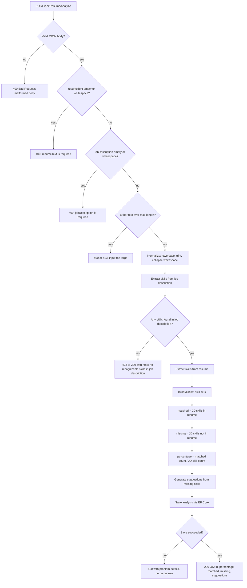
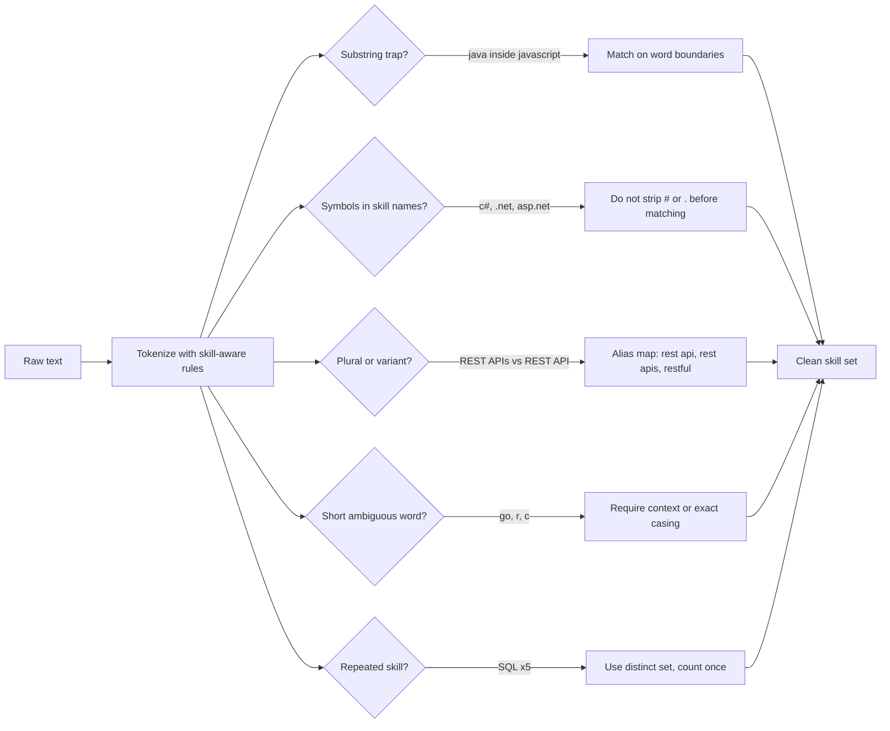
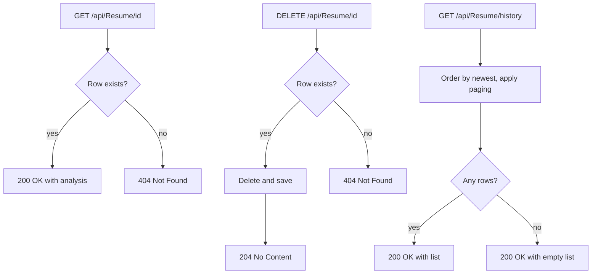
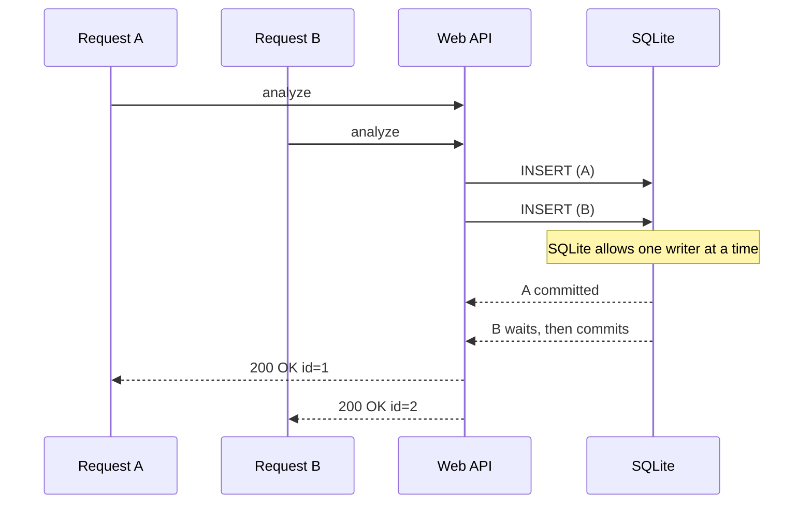

# Workflow 1: Request Lifecycle and Edge Cases

How `POST /api/Resume/analyze` should behave from the first byte in to the saved result, including the awkward inputs a rule-based skill matcher has to survive.

> These diagrams describe the recommended behaviour. Check each branch against your controller and `ResumeAnalyzerService` and adjust where the code differs.

## Analyze request flow

## Matching pitfalls and how to handle them

## Other endpoints

## Concurrency note

Each request gets its own scoped `DbContext`, so requests never share tracked entities. Brief write contention on SQLite is handled by its busy timeout; sustained write load is the signal to move to a server database (see workflow 2).

## Behaviour summary

| Situation | Expected behaviour |
|---|---|
| Missing or blank resume or job description | 400 with a clear message |
| Job description with no known skills | Explicit message rather than a misleading 0% or a divide-by-zero |
| `java` inside `javascript` | No false match, use word-boundary matching |
| `c#`, `.net`, `asp.net core` | Symbols preserved during tokenizing |
| Same skill repeated | Counted once |
| Unknown id on GET or DELETE | 404 |
| Empty history | 200 with an empty list |
| Database failure | 500, nothing half-saved |
