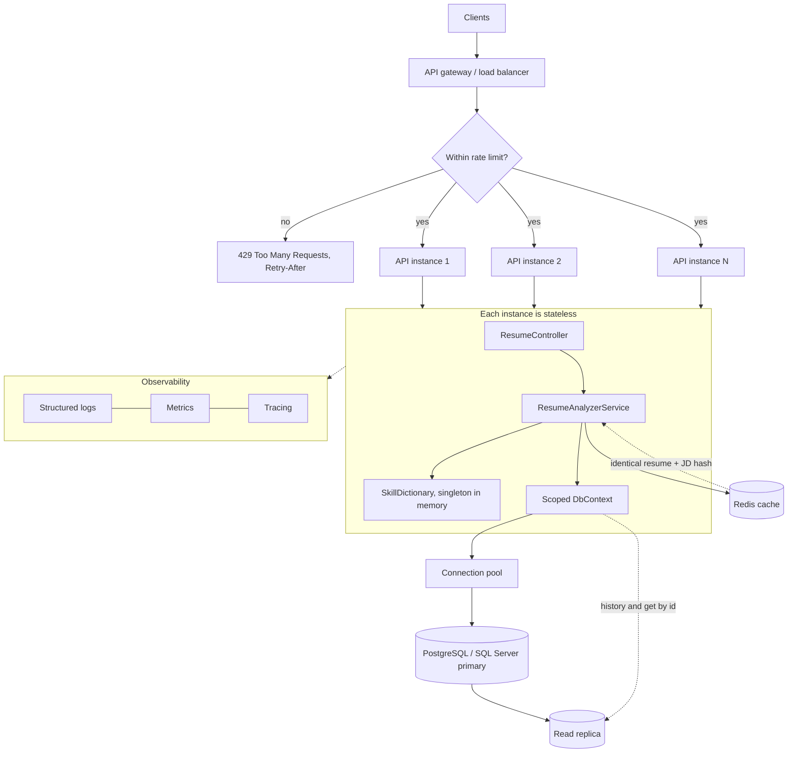
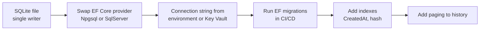
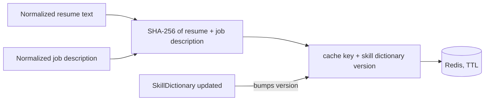
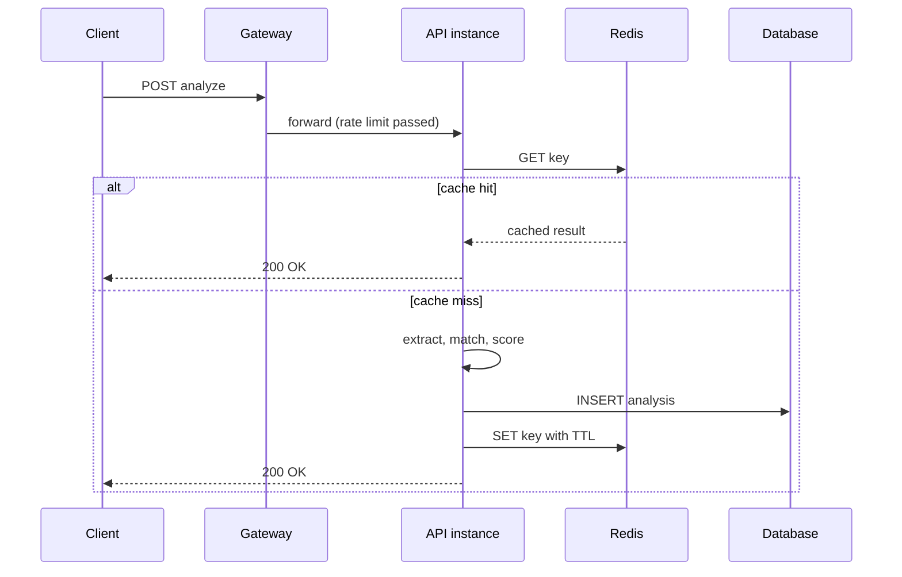

# Workflow 2: Scaling the API

How to take the single-process API with SQLite and grow it into something that handles real traffic. Each step is independent, so adopt them as the load demands.

## Target architecture

## Migration path off SQLite

## Cache key for repeat analyses

Including the dictionary version in the key means a dictionary change invalidates old results without clearing the cache by hand.

## Request path under load

## Scaling levers

| Bottleneck | Lever |
|---|---|
| SQLite single writer | Move to PostgreSQL or SQL Server, keep the EF Core code |
| Repeated identical requests | Redis cache keyed by input hash and dictionary version |
| Skill lookup cost | Load `SkillDictionary` once as a singleton and use a `HashSet` for lookups |
| Large history lists | Paging, index on creation time, read replica |
| CPU-heavy analysis | Scale instances horizontally, they hold no session state |
| Abusive clients | Rate limiting middleware or gateway policy |
| Slow requests | Async EF Core calls, request timeouts, cancellation tokens |
| Debugging at scale | Structured logging, metrics, health checks, tracing |
| Deployment | Docker image, Azure App Service or container platform, auto-scale on CPU or queue depth |
