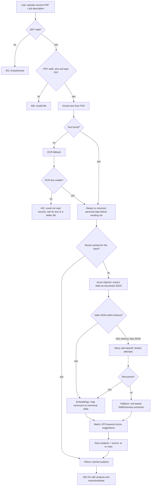
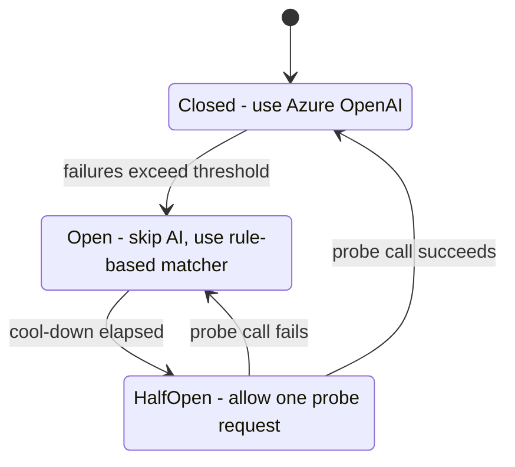
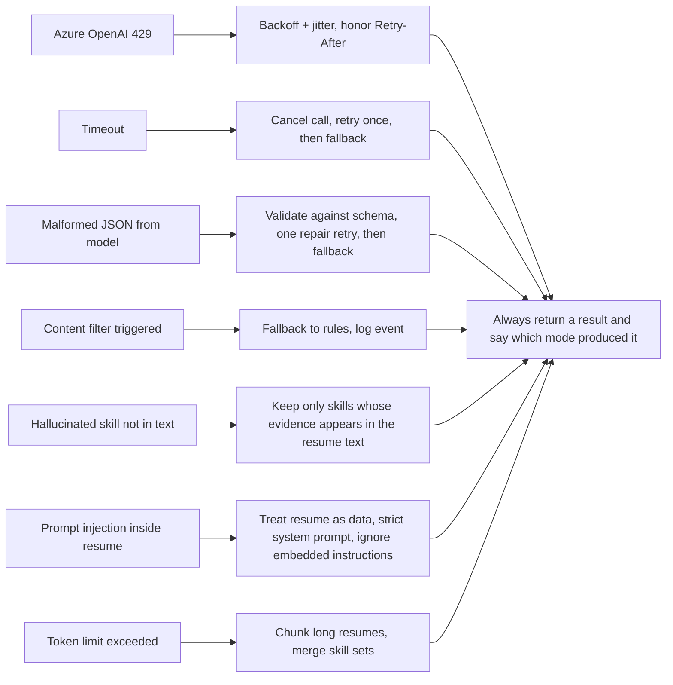
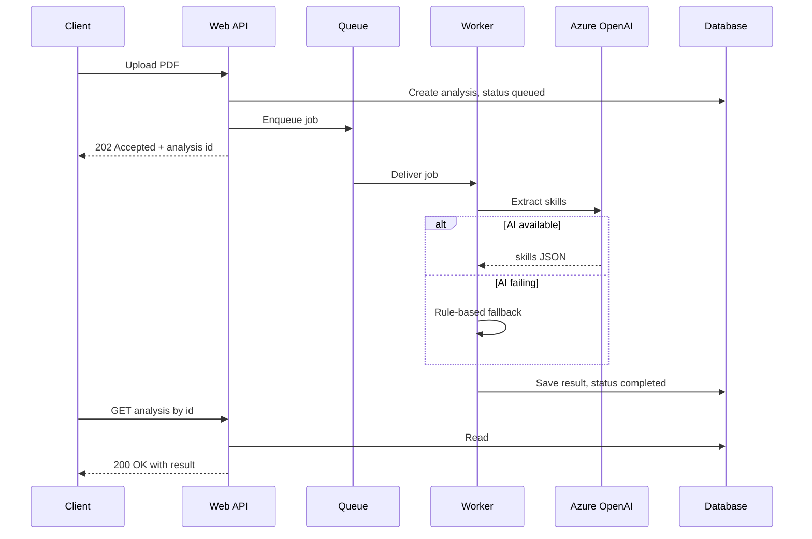

# Workflow 3: V2 AI Pipeline and Failure Handling

The roadmap version: PDF upload, LLM-based skill extraction, and graceful fallback to the existing rule-based matcher when the AI path fails. The rule-based engine stays as the safety net.

## End-to-end V2 flow

## Circuit breaker around the AI call

While the breaker is open, requests are served by the rule-based matcher immediately, so users get an answer instead of waiting on a failing dependency.

## Failure handling

## Background processing for large uploads

## Design notes

| Concern | Approach |
|---|---|
| Availability | Rule-based matcher is always available as the fallback |
| Transparency | Response reports whether the result came from AI or rules |
| Cost | Cache by input hash, trim text before sending, skip the AI call for tiny inputs |
| Privacy | Minimize personal data sent to the model, no resume text in logs |
| Trust | Verify AI-extracted skills against the source text before scoring |
| Security | JWT on endpoints, upload size and type limits, secrets in Key Vault |
