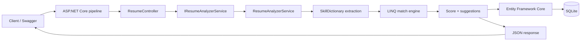

<div align="center">

# AI Resume Analyzer

**Compare a resume against a job description. Get a skill-match score, gaps, and fixes.**


</div>

---

## Overview

A compact ASP.NET Core Web API that takes resume text and a job description, extracts skills from both, and returns:

- a **match percentage**
- the **matched skills**
- the **missing skills**
- **improvement suggestions** for the resume

Every analysis is saved to SQLite, so you can list previous results, fetch one by id, or delete it.

---

## Features

| Area | What you get |
|---|---|
| Analysis | Resume vs job-description comparison |
| Matching | Skill extraction and matching with a rule-based `SkillDictionary` |
| Scoring | Match percentage, matched and missing skills |
| Guidance | Resume improvement suggestions |
| History | Saved analyses, get by id, delete |
| Docs | Swagger / OpenAPI UI |
| Persistence | Entity Framework Core with SQLite |

---

## Tech stack

- C#
- ASP.NET Core 8 Web API
- Entity Framework Core
- SQLite
- REST APIs
- Swagger / OpenAPI
- LINQ
- Dependency Injection

---

## Architecture

The animated diagram above shows the full path. The same flow in text:



| Component | Role |
|---|---|
| `ResumeController` | HTTP endpoints, request and response mapping |
| `IResumeAnalyzerService` | Abstraction injected through the DI container |
| `ResumeAnalyzerService` | Skill extraction, matching, scoring, suggestions |
| `SkillDictionary` | Known skills used by the rule-based matcher |
| Entity Framework Core | Maps analyses to SQLite tables |

More diagrams in [`docs/workflows`](docs/workflows):

| Diagram | Covers |
|---|---|
| [Request lifecycle and edge cases](docs/workflows/01-request-lifecycle-and-edge-cases.md) | Validation, empty inputs, no skills found, matching pitfalls, not-found handling |
| [Scaling the API](docs/workflows/02-scaling-the-api.md) | SQLite to PostgreSQL / SQL Server, stateless instances, caching, rate limiting |
| [V2 AI pipeline and failure handling](docs/workflows/03-v2-ai-pipeline-and-failure-handling.md) | PDF upload, Azure OpenAI extraction, fallback to rules, retries |

---

## API endpoints

| Method | Endpoint | Purpose |
|---|---|---|
| `POST` | `/api/Resume/analyze` | Analyze resume against job description |
| `GET` | `/api/Resume/history` | Get previous analyses |
| `GET` | `/api/Resume/{id}` | Get one analysis |
| `DELETE` | `/api/Resume/{id}` | Delete an analysis |

---

## Upload to GitHub

1. Create or open your repository on GitHub
2. Click **Add file → Upload files**
3. Extract the ZIP first, then upload the **contents** of the folder (including `assets/` and `docs/`, so the diagram above renders)
4. Commit to `main`

Add a `.gitignore` so build output and local databases are not committed:

```text
bin/
obj/
*.db
*.db-shm
*.db-wal
```

---

## Run the project

### 1. Install

Install the [.NET 8 SDK](https://dotnet.microsoft.com/download/dotnet/8.0).

### 2. Open the project

```bash
cd AIResumeAnalyzer
```

### 3. Restore packages

```bash
dotnet restore
```

### 4. Run

```bash
dotnet run
```

The terminal prints a local URL. Open its `/swagger` page in your browser, for example:

```text
https://localhost:7xxx/swagger
```

---

## Try it: `POST /api/Resume/analyze`

Request body:

```json
{
  "resumeText": "B.Tech student with experience in Python, Java, SQL, React, Git, REST APIs and Machine Learning. Built projects using FastAPI and MongoDB.",
  "jobDescription": "We are looking for a developer with C#, .NET, ASP.NET Core, SQL, REST API, Git, React and Docker experience."
}
```

Example response (illustrative, exact values depend on your `SkillDictionary`):

```json
{
  "id": 1,
  "matchPercentage": 43,
  "matchedSkills": [
    "sql",
    "react",
    "git",
    "rest api"
  ],
  "missingSkills": [
    "c#",
    ".net",
    "asp.net core",
    "docker"
  ],
  "suggestions": [
    "Consider highlighting experience with: c#, .net, asp.net core, docker."
  ]
}
```

---

## Roadmap

For a second version, replace the rule-based `SkillDictionary` matching with an LLM such as Azure OpenAI or Gemini.

- [ ] JWT authentication
- [ ] React frontend
- [ ] PDF resume upload
- [ ] Azure OpenAI integration
- [ ] PostgreSQL / SQL Server
- [ ] Skill extraction using embeddings
- [ ] ATS keyword scoring
- [ ] Docker deployment
- [ ] Azure App Service deployment

See the [workflow diagrams](docs/workflows) for how these fit together.

---

## Resume bullet

**AI Resume Analyzer | C#, ASP.NET Core, Entity Framework Core, SQLite, REST API**

- Developed an ASP.NET Core Web API that analyzes resumes against job descriptions using automated skill extraction and keyword matching.
- Implemented RESTful APIs, dependency injection, LINQ-based analysis, Entity Framework Core persistence, CRUD operations, and Swagger/OpenAPI documentation.
- Generated match scores, missing-skill analysis, and actionable resume improvement suggestions with persistent analysis history.
